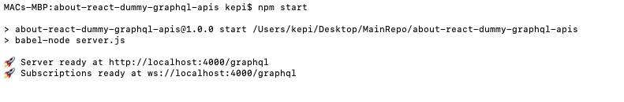
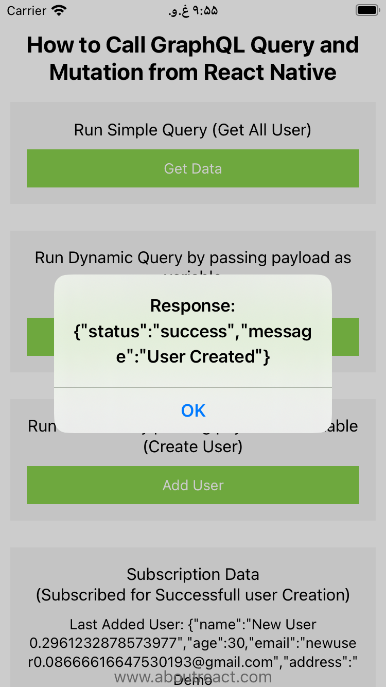

# graphQLDemo

GraphQL Server Setup:

1. Clone Repo: git clone https://github.com/SnehalAgrawal/about-react-dummy-graphql-apis.git

2. Jump into the directory: cd about-react-dummy-graphql-apis

3. Install node_module: npm install

4. Run GraphQL Server: npm start

This will start your GraphQL server for you

Please follow below steps setup react-native project:

1. Setup React Native environment in your machine. Follow https://reactnative.dev/docs/environment-setup to do environment setup in machine.

2. Clone main branch of this repo.

3. Open terminal & navigate on root directory of project and run `npm install` or `yarn install`.

4. Install cocoapods using command `yarn pod` or `npm run pod`.

5. set Android Sdk location in android/local.properties file e.g. for Mac machine => sdk.dir=/Users/{currentUser}/Library/Android/sdk

6. Now code is ready to run. You can use `yarn ios` or `npm run ios` to run app in iPhone and `yarn android` or `npm run android` to run app in Android devices.

